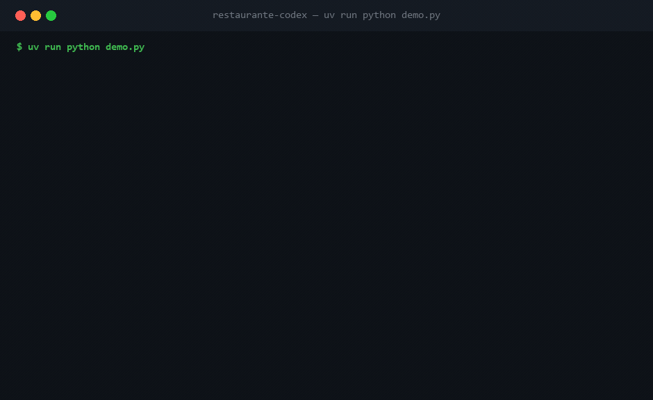

# 🍔 Restaurante-Codex

> Um sistema de restaurante, em Python, feito para **ensinar engenharia de software na
> prática**. Cada princípio do *Codex de Engenharia* aparece como uma peça concreta de
> código — com o **porquê** ao lado (`# CODEX:`) e o **quando usar / quando não** nos docs.

Não é um framework. É um **objeto de estudo executável**: você roda, lê, quebra de
propósito, e sente cada conceito em vez de decorá-lo.



> A cozinha prepara pratos em paralelo (`asyncio.gather`), mas cada estação é um recurso
> limitado (`asyncio.Semaphore`) — repare nos timestamps: o Hambúrguer só entra na chapa
> depois que o Filé sai.

```bash
uv sync                    # cria o ambiente e instala as ferramentas
uv run python demo.py      # roda a simulação narrada (comece por aqui)
uv run pytest              # a suíte de testes
uv run ruff check .        # linter (regra ALL)
uv run pyright             # type checker estrito
```

---

## Por que um restaurante?

Porque um restaurante **é** um sistema concorrente por natureza: vários pedidos ao mesmo
tempo, estações de trabalho que são recursos limitados (a chapa faz um bife por vez),
espera de I/O (o prato cozinha sozinho), e um fluxo de estados rígido (um pedido não pode
ser "entregue" antes de "pronto"). Todos os conceitos caem naturalmente.

Rode o `demo.py` e **veja pelos timestamps** dois pedidos sendo preparados em paralelo —
a assincronicidade deixa de ser abstração e vira intuição.

---

## As camadas (a arquitetura é, ela mesma, uma aula)

O código segue a arquitetura em 4 camadas do Codex. A regra de ouro: **dependências
apontam pra dentro**. O domínio não conhece ninguém; os adapters conhecem tudo.

```
   demo.py ─────────────► app.py  (composition root: monta e injeta)
                            │
        ┌───────────────────┼───────────────────┐
        ▼                   ▼                   ▼
  adaptadores/         servicos/            (usam)
  (sistema nervoso)    (órgãos)               │
  implementam ──┐      orquestram ────────────┤
                ▼                              ▼
            portas/  ◄──────────────────  dominio/
            (interfaces)                  (regras puras, esqueleto)
```

| Camada | Pasta | Papel | Pode importar |
| --- | --- | --- | --- |
| **Esqueleto** | `dominio/`, `portas/` | Contratos e regras puras. Zero I/O, zero vendor. | nada externo |
| **Órgãos** | `servicos/` | Lógica headless: cálculo, cozinha async, orquestração. | domínio + portas |
| **Sistema nervoso** | `adaptadores/` | Implementações concretas (memória, fake de pagamento…). | domínio + portas |
| **Tomada** | `app.py` | Injeta tudo. **Único** lugar que conhece adapters concretos. | tudo |

---

## Mapa: conceito → onde no código → quando usar

| Conceito (Codex) | Onde ver na prática | Quando aplicar | O freio (quando NÃO) |
| --- | --- | --- | --- |
| **SSoT** | `dominio/cardapio.py` — preços moram só aqui | Todo fato com um dono | Desnormalizar de propósito (com fonte explícita) |
| **Estado ilegal irrepresentável** | `dominio/pedido.py` — `Consumo` (tipo-soma) | Quando "só um dos casos vale" | — |
| **Fail-fast** | `dominio/erros.py`, máquina de estados | Validar no boundary | Não engula exceção; mas não valide o impossível |
| **DIP / Ports & Adapters** | `portas/` + `adaptadores/` | Toda dependência externa (DB, pagamento…) | YAGNI: não crie porta pra algo que nunca troca |
| **ISP** | 4 portas pequenas em vez de 1 gorda | Interfaces focadas | Não fatie ao ponto de virar cerimônia |
| **Mechanism × Policy / Strategy** | `servicos/conta.py` + `adaptadores/precos.py` | Regra que varia (preço, desconto) | Rule of Three: espere a variação real |
| **DI / Composition root** | `app.py` | Montar o sistema num lugar só | — |
| **Assincronicidade** | `servicos/cozinha.py` | Trabalho I/O-bound concorrente | Não use async pra CPU puro |
| **Law of Demeter** | `servicos/balcao.py` | Fale só com colaboradores diretos | — |
| **KISS / Least Power** | `dominio/dinheiro.py` (int centavos, não `Decimal`/`float`) | Sempre que a peça simples resolve | — |

Os detalhes de cada um estão em [`docs/`](docs/), um arquivo por conceito.

---

## Roteiro de estudo sugerido

1. **Rode** `uv run python demo.py` e leia a saída narrada de cima a baixo.
2. **`dominio/dinheiro.py`** — o value object que torna um bug clássico impossível.
3. **`dominio/pedido.py`** — máquina de estados + tipo-soma (o coração conceitual).
4. **`portas/` + `adaptadores/`** — a mesma interface, implementações trocáveis.
5. **`servicos/cozinha.py`** — assincronicidade explicada por analogia física.
6. **`app.py`** — como tudo se conecta num só ponto.
7. **Quebre de propósito:** inverta um `if` na cozinha, troque um valor num preço — e veja
   os testes te pegarem (`uv run pytest`). É o sensor de regressão em ação.

---

## Ferramentas

`uv` (ambiente), `ruff` (format + lint, `select = ALL` com ignores documentados no
`pyproject.toml`), `pyright` (strict), `pytest` + `pytest-asyncio`. O pipeline de
qualidade — `ruff format` → `ruff check` → `pyright` → `pytest` — roda verde.

## Licença

MIT. Use, copie, ensine.
